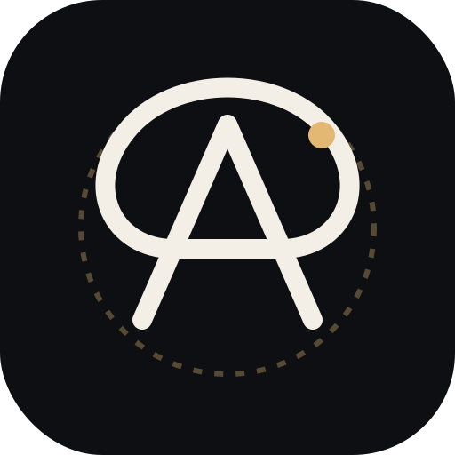

# ⚡ AuraNote AI Studio

<p align="center">
  
</p>

<p align="center">
  <b>Le carnet de réflexions intelligent et "Second Cerveau" pour centraliser vos échanges avec les IA</b>
</p>

<p align="center">
  <a href="#-présentation">Présentation</a> •
  <a href="#-fonctionnalités-clés">Fonctionnalités</a> •
  <a href="#-architecture">Architecture</a> •
  <a href="#-installation-locale">Installation</a> •
  <a href="#-déploiement-sur-railway">Déploiement Railway</a> •
  <a href="#-script-python-de-nettoyage">Script Python</a>
</p>

---

## 💡 Présentation

**AuraNote AI Studio** est un carnet de réflexions intelligent et un coffre-fort de connaissances personnel. Il est spécialement conçu pour centraliser, organiser et pérenniser toutes les idées, décisions stratégiques, choix d'architecture et synthèses issues de vos interactions avec les IA (**Gemini**, **Claude**, **ChatGPT**).

---

## 🎯 Fonctionnalités Clés

- **⚡ Smart Paste (Coller Intelligent) :** Bouton 1-clic qui prend le texte copié depuis Gemini/Claude/ChatGPT, purge les scories d'UI (*"ChatGPT a dit :"*, *"Copy code"*), déduit un titre propre et classe la note.
- **🗂️ Classement par Auras Thématiques :**
  - 🟣 **Stratégie & Décisions**
  - 🔵 **Actions & Objectifs**
  - 🟢 **Technique & Architecture**
  - 🟡 **Workflows & Processus**
  - 🟠 **Inspirations & Idées brutes**
- **📂 Synchronisation Fichier Local (`Monidée.md`) :** Intégration de la *File System Access API* du W3C pour synchroniser physiquement vos notes dans votre fichier local `Monidée.md`.
- **🧩 Extension Navigateur PC (Chrome MV3) :** Clic droit sur n'importe quel site IA -> *Envoyer vers AuraNote*.
- **📱 Partage Mobile PWA (Web Share Target) :** Menu Partager natif Android/iOS vers AuraNote.
- **📄 Exportation 1-Clic :** Export au format `.md` (Markdown) ou `.pdf` (Impression épurée).
- **🐍 Script Python de Mise au Propre :** Script CLI `scripts/clean_and_structure.py` pour dépolluer et restructurer les notes brutes.

---

## 🏛️ Architecture du Projet

Le projet suit une architecture **Local-First & Modular Ingestion** :

```
auranote-ai-studio/
├── index.html                   # Entrée SPA principal HTML5
├── manifest.webmanifest         # PWA Manifest & Web Share Target
├── sw.js                        # Service Worker PWA
├── assets/                      # Icônes & SVG Officiel
│   └── icon.svg
├── css/                         # Design System Obsidienne Nuit (#0D0F12, #E2B872)
│   ├── main.css
│   ├── auras.css
│   └── zen-editor.css
├── js/                          # Code Applicatif ES6+
│   ├── config.js
│   ├── app.js
│   ├── models/Note.js
│   ├── services/
│   │   ├── StorageService.js        (IndexedDB Engine)
│   │   ├── LocalFileSyncService.js  (Sync Monidée.md)
│   │   ├── SmartPasteService.js     (Cleaning & Title Generator)
│   │   └── ExportService.js         (Markdown & PDF Export)
│   ├── components/                  (Composants UI)
│   └── utils/sanitizer.js           (Sanitizer XSS & UI Scraps)
├── extension/                   # Extension Chrome Manifest V3
├── server/                      # Serveur Node.js / Express pour Railway
│   ├── index.js
│   └── routes/ingest.js
└── scripts/                     # Scripts d'Ingénierie
    └── clean_and_structure.py   (Script Python de nettoyage)
```

---

## 💻 Installation & Lancement Local

### Prérequis
- Node.js v18+ 
- Python 3.8+ (optionnel, pour les scripts CLI)

```bash
# 1. Cloner le dépôt
git clone https://github.com/Alpha2-far/auranote-ai-studio.git
cd auranote-ai-studio

# 2. Installer les dépendances
npm install

# 3. Lancer le serveur local
npm start
```

Rendez-vous ensuite sur **[http://localhost:3000](http://localhost:3000)**.

---

## 🚂 Déploiement sur Railway

Ce dépôt est configuré pour être déployé en 1-clic sur **Railway** :

1. Connectez-vous sur [Railway.app](https://railway.app).
2. Cliquez sur **New Project** -> **Deploy from GitHub repo**.
3. Sélectionnez le dépôt `Alpha2-far/auranote-ai-studio`.
4. Railway détectera automatiquement le fichier `railway.json` / `package.json` et déploiera votre application !

### Variables d'Environnement Optionnelles (Railway) :
- `PORT` : `3000` (défini automatiquement par Railway)
- `API_SECRET` : Votre jeton secret pour sécuriser l'API Webhook `/api/v1/notes/ingest`

---

## 🐍 Script Python de Nettoyage

```bash
# Dépolluer et structurer un texte brut en Markdown
python3 scripts/clean_and_structure.py "Votre texte brut ou réponse IA"

# Générer une sortie JSON pour l'API
python3 scripts/clean_and_structure.py --json "Mon texte"
```

---

## 📜 Licence

Projet développé avec soin sous licence MIT.
